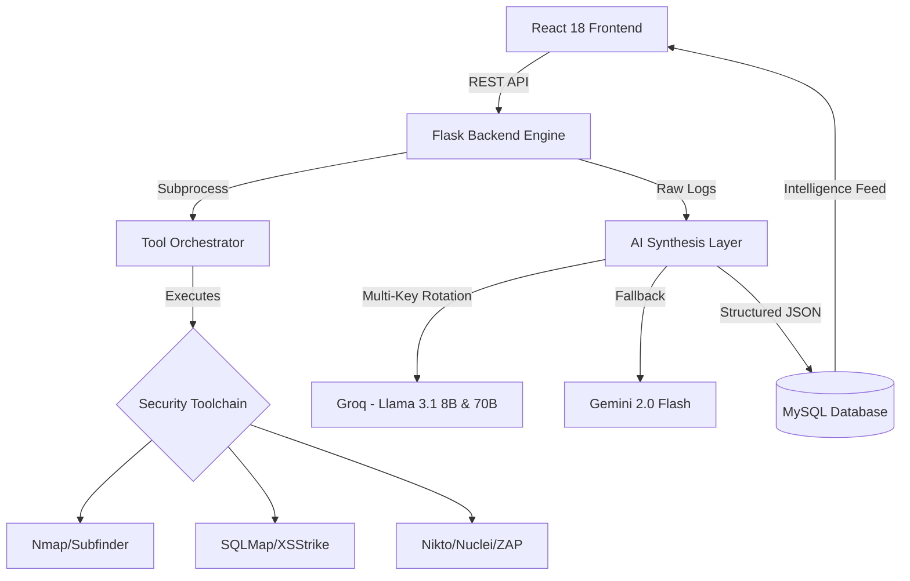

# ReconX AI 🛡️
### The Autonomous Security Intelligence Engine

[](https://github.com/your-repo)
[](https://parrotsec.org)
[](#)

> **"Turning Raw Data into Strategic Intelligence."**

ReconX AI is a high-impact, autonomous DevSecOps platform designed to fully automate the heavy lifting of penetration testing. By orchestrating industry-standard hacking tools and actively synthesizing their outputs through a multi-engine AI reasoning layer, ReconX AI reduces a traditional 7-day security audit down to 2 minutes.

---

## 🌟 Core Features

### 1. Autonomous Agentic Pilot 🤖
ReconX AI goes beyond a "wrapper" for CLI tools. It possesses an autonomous **Agentic Pilot Phase**. The AI evaluates incremental scan logs and makes real-time decisions on whether to launch targeted follow-up scans (e.g., triggering `nuclei` if `nmap` finds an exposed HTTP service, or launching `sqlmap` if a parameter seems vulnerable).

### 2. ReconX Copilot (Agentic Chatbot) 🗨️
A persistent, context-aware chatbot powered by **LangGraph** and **Llama 3.1 (via Groq Key Rotation)**. The Copilot natively accesses your `chat_history` and lives in a holographic widget on the dashboard. It autonomously interacts with the MySQL database to answer questions, explain security telemetry, and strategize patches at zero API rate-limit risk.

### 3. Live Operator Mirroring 🖥️
Built for Hackathons and Live Presentations. As the background Flask threads execute scans, ReconX detects the host Linux GUI (via `DISPLAY :0`) and natively spawns local `xterm`/`qterminal` windows. Judges and users can watch the raw hacking scripts execute in real time.

### 3. Cascading AI Engine (Self-Correcting Architecture) 🧠
- **Llama 3.1 8B (Fast Terminal Mode):** Summarizes real-time terminal chunks instantly for fast, live operator feedback.
- **Llama 3.1 70B (Deep Reasoning & Validator Mode):** Operates on a delay. It ingests all collected raw telemetry at the end of the scan to finalize OWASP correlations and write executive remediation plans. **Crucially, the 70B model acts as an overriding validator—cross-checking and correcting any hallucinations or missed vulnerabilities from the faster 8B model.**
- **Key Rotation Framework:** Bypasses LLM rate-limits utilizing up to 20 rotating `GROQ_API_KEY`s.
- **Cascading Fallbacks:** `Groq API` ➞ `Google Gemini Flash 2.0` ➞ `OpenAI API` ➞ `Local Heuristic Engine` (Ensures the platform *never* fails during a demo).

### 4. Advanced Threat Intel (OSINT) 🌍
Integrates directly with public intelligence endpoints to enrich scan targets:
- **Shodan API:** Checks public vulnerability footprints and passive open ports.
- **VirusTotal API:** Checks target reputation against global malware data.

### 5. Cyberpunk Dashboard 🟢
A cutting-edge `React 18` + `Tailwind CSS v4` + `Framer Motion` frontend utilizing a "Green & Black" highly immersive cyberpunk UI/UX, complete with global anti-right-click protection to simulate an elite terminal interface.

---

## 🏗️ System Architecture

ReconX AI uses a **Decoupled Agentic Architecture** for high performance and resilience.



---

## 🛡️ Global Security Toolchain

The platform orchestrates a deep-stack toolchain, specifically hardened for Linux/Parrot OS environments.

| Module | Core Tool | Purpose |
| :--- | :--- | :--- |
| **Intelligence** | `Shodan`, `VirusTotal` | Maps public exposure and domain reputation. |
| **Reconnaissance** | `Whois`, `Subfinder` | Maps domain ownership and attack surface. |
| **Network Audit** | `Nmap` | Active port discovery & service versioning. |
| **DAST Scanning** | `Nikto`, `Nuclei` | Scans for 8,000+ CVEs & server misconfigs. |
| **Injection Audit** | `SQLMap`, `XSStrike` | Probes for SQLi and Cross-Site Scripting. |
| **Application Logic** | `OWASP ZAP` | Baseline automated web app testing. |
| **Availability** | `Slowhttptest` | Resource exhaustion and DoS audit. |

---

## 🔒 Security Hardening

ReconX AI has been strictly audited by automated agents and secured against top generic vulnerability threats:
*   **Command Injection Blocked:** All user input (`target`) is sanitized via strict regex `r'^[a-zA-Z0-9.-]+$'` blocking `-` flag injections.
*   **Prompt Injection Walled:** AI prompts sandbox external HTTP headers to prevent targets from inserting rogue directives into the final reports.
*   **Authorization Enforcement:** Strict Horizontal/Vertical IDOR prevention via `user_id` validation for every report fetch and scan cancellation request.
*   **Rate Limits:** `/api/scans/start` is heavily throttled with memory-stored global cooldowns to prevent Denial of Wallet.
*   **Zombie Cleanup:** Python backend auto-resets hanging scans if the server crashes unexpectedly.

---

## 📂 Project Structure

```bash
ReconX-AI/
├── frontend/               # React + Vite + Tailwind v4 + Framer Motion
│   ├── src/
│   │   ├── pages/          # Dashboard, Scan, Documentation, Reports
│   │   ├── components/     # Sidebar, CopilotWidget, TerminalUI
│   │   └── services/       # api.js (Axios Orchestrator)
├── backend/                # Python Flask Intelligence Layer
│   ├── app.py              # Entry Point & Schema migrations
│   ├── core/               # Intel Engine, AI Routing, Database connectors
│   ├── routes/             # Scans, Authentication, PDF Reports, Cyber Copilot
│   ├── requirements.txt    # Python dependencies
│   └── logs/               # Live Output buffers
└── database/
    ├── schema.sql          # Advanced DDL Schemas
    └── seed.sql            # Demo users / Hackathon data
```

---

## ⚡ Setup & Quick Start Instructions

### 1. Database Initialization
```bash
mysql -u root -p < database/schema.sql
mysql -u root -p < database/seed.sql  # Optional: For demo data
```

### 2. Environment Configuration
Create a `.env` in the root `/backend/` directory:
```env
# AI APIs (Rotational Arrays supported)
GROQ_API_KEY_1=gsk_...
GROQ_API_KEY_2=gsk_...
GEMINI_API_KEY=AIza...
OPENAI_API_KEY=sk-...

# Cyber Intelligence APIs
SHODAN_API_KEY=your_key
VIRUSTOTAL_API_KEY=your_key

# Backend Security
DB_PASSWORD=your_password
JWT_SECRET=your_secure_JWT_entropy
```

### 3. Launching the Backend Engine
The backend will automatically create tables, run zombie-process-cleanups, and expose the API on port 5000.
```bash
cd backend
pip install -r requirements.txt
python3 app.py
```

### 4. Launching the Frontend Interface
```bash
cd frontend
npm install
npm run dev
```

---

## 🚀 Hackathon Presentation Strategy

### For the PPT Team:
*   **Problem:** Manual OSINT and security audits take days. Hiring Pentesters costs thousands of dollars.
*   **Solution:** ReconX AI - An autonomous, 24/7 "Hacker in a Box."
*   **Key Innovation:** Multi-tool CLI orchestration + Parallel AI logic + Infinite Model Scaling (API Key rotation ensuring absolute 0% downtime).
*   **Business Impact:** Reduces initial vulnerability discovery to mere minutes while generating actionable patch management tickets.

---

*Built with ❤️ for the Hackathon Selection · © 2026 Team Thunder Pulse*
